<p align="center">
  
</p>

<p align="center">
  
  <a href="https://github.com/Nenaavat-Yugender?tab=repositories"></a>
  <a href="mailto:Nenavathnayak5603@gmail.com"></a>
</p>

---


### ⚡ About me

```ts
const yugandar = {
  role:      "Software Engineer",
  company:   "VMock India Pvt Ltd",
  building:  "AI-powered career-readiness products",
  focus:     ["advanced algorithms", "new AI technologies"],
  askMeAbout:["Web Development", "MERN Stack", "DSA"],
  funFact:   "I think I'm funny 😄",
};
```

- 👨‍💻 All my projects: **[github.com/Nenaavat-Yugender?tab=repositories](https://github.com/Nenaavat-Yugender?tab=repositories)**
- 📫 Reach me: **Nenavathnayak5603@gmail.com**

<br clear="right"/>

---

### 🛠️ Tech stack

| | |
|---|---|
| **Frontend** |  |
| **Backend & DB** |  |
| **AI / ML & Languages** |  |
| **Tools** |  |

---

### 📊 GitHub at a glance

<p align="center">
  
  
</p>

<p align="center">
  
</p>

<p align="center">
  <picture>
    <source media="(prefers-color-scheme: dark)" srcset="https://raw.githubusercontent.com/Nenaavat-Yugender/Nenaavat-Yugender/output/github-snake-dark.svg" />
    
  </picture>
</p>

---

### 🏆 Problem solving

<p align="center">
  <a href="https://codeforces.com/profile/yugandar-3755"></a>
  <a href="https://leetcode.com/nenavathnayak5603"></a>
  <a href="https://auth.geeksforgeeks.org/user/nenavathnzej8"></a>
</p>

### 🤝 Connect

<p align="center">
  <a href="mailto:Nenavathnayak5603@gmail.com"></a>
</p>
