  

  
  
  

  

  👨‍💻 <b>All my projects:</b> <a href="https://github.com/Nenaavat-Yugender?tab=repositories">github.com/Nenaavat-Yugender?tab=repositories</a>
  &nbsp;·&nbsp;
  📫 <b>Reach me:</b> <a href="mailto:Nenavathnayak5603@gmail.com">Nenavathnayak5603@gmail.com</a>

  

  
  

  <picture>
    <source media="(prefers-color-scheme: dark)" srcset="https://raw.githubusercontent.com/Nenaavat-Yugender/Nenaavat-Yugender/output/github-snake-dark.svg" />
    
  </picture>

  
  
  
  

